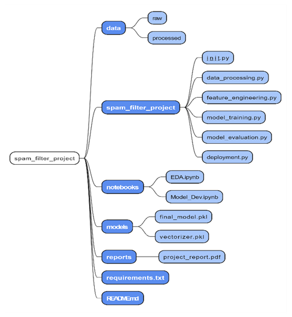
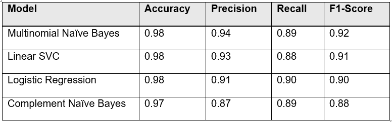
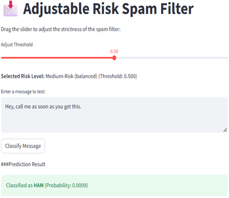
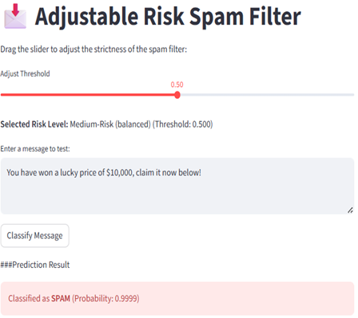
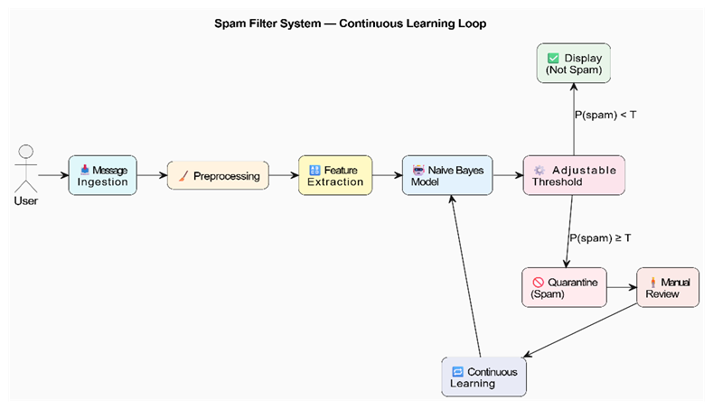

# DLBDSME01 - Model Engineering Case Study: Spam Filter Development

## 1. Project Overview

This project develops a binary classification model to serve as an adjustable-risk spam filter for a customer-facing communication channel.  
The primary objective is to create a filter that is interpretable and tunable, prioritizing the minimization of False Positives (FPs) to prevent customer churn.

**Chosen Model:** Multinomial Naive Bayes (MNB)  
**Key Achievement:** Implementation of an Adjustable Risk Threshold (T = 1.0000) guaranteeing a 100% False Positive-Free channel.  
**Methodology:** CRISP-DM (Cross-Industry Standard Process for Data Mining)
 ---

## 2. Repository Structure

The repository follows a modular, standardized layout for reproducibility and clarity.


 ---

## 3. Setup and Installation

### Prerequisites
You will need Python (3.9+) and the following libraries:

```bash
pip install -r requirements.txt

Cloning the Repository
Clone the repository to your local machine:

```bash
git clone https://github.com/CRMawande/spam_filter_project.git
cd spam_filter_project
 ---
## 4. Data Preparation Steps
The data is processed using a custom NLP pipeline to retain key features, including numeric tokens:

- **Cleaning** (`spam_filter_project/data_processing.py`): Removes duplicates and applies a regex filter to remove stop words and punctuation while retaining numeric tokens (e.g., '1000', '0800').
- **Feature Engineering** (`spam_filter_project/feature_engineering.py`):
  - **Count Matrix**: Used for the optimal MNB model.
  - **TF-IDF Matrix**: Used for comparison models (Logistic Regression, Linear SVC, Complement Naive Bayes).
  - **Scaling**: `message_length` is scaled using MinMax Scaling.
   ---

## 5. Model Selection and Results
### Final Model and Metrics
The **Multinomial Naive Bayes (MNB)** model was selected after comparing performance with Logistic Regression, Linear SVC, and Complement Naive Bayes.



## Adjustable Risk Strategy
The deployment uses the MNB model's probability score ($ \mathbf{P}(\text{spam}) $) to create two risk channels:

| Channel              | Classification Logic           | Business Rationale |
|----------------------|--------------------------------|--------------------|
| **Immediate Display**| $ \mathbf{P}(\text{spam}) < 1.0000 $ | **Low-Risk (FP-Free)**. Guarantees genuine customer feedback is never wrongly blocked. |
| **Quarantine Folder**| $ \mathbf{P}(\text{spam}) \geq 1.0000 $ | **High-Risk**. Captures only messages the model is 100% certain are spam, minimizing manual review time. |
 ---

## 6. Running the Application
To run the interactive demonstration and test adjustable thresholds:

```bash
streamlit run spam_filter_project/deployment.py

- Use the slider to adjust risk thresholds dynamically.
- Enter a message to see real-time classification.
- The system visualizes how changing thresholds affects spam detection probability.
 ---

## 7. Deployment Notes

- Adjustable risk thresholds are based on the Precision-Recall Curve of the MNB model.
- Immediate Display guarantees zero False Positives, while Quarantine Folder messages are for manual review.
- GUI is simple, interpretable, and allows the service team to control spam-risk levels efficiently.

   
 ---

## 8. Future Work

- Implement a Continuous Learning loop by incorporating False Negatives from quarantine review into training data.



- Explore resampling techniques (e.g., SMOTE) or class weighting to address class imbalance.
- Enhance feature engineering with lemmatization and character n-grams to capture misspellings.
- Continuously evaluate thresholds to maintain a balance between Precision and Recall.